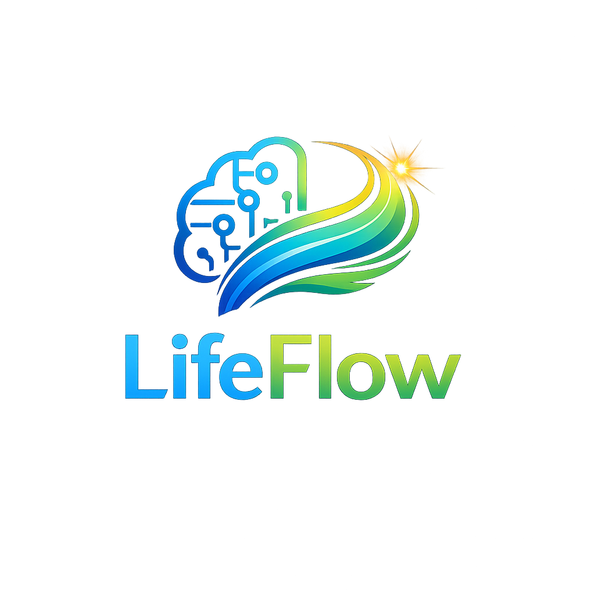

# 🚀 LifeFlow | دستیار هوشمند تحلیل بهره‌وری

<p align="center">
  
</p>

<p align="center">
سامانه هوشمند تحلیل بهره‌وری، مدیریت زمان و تحلیل رفتار کاربران با استفاده از هوش مصنوعی
</p>

---

# 🌐 نسخه آنلاین

**مشاهده پروژه:**

🔗 https://lifefloow.vercel.app

---

# 📖 معرفی پروژه

**LifeFlow** یک پلتفرم هوشمند تحلیل بهره‌وری است که با هدف کمک به افراد و سازمان‌ها برای شناخت الگوهای رفتاری، افزایش تمرکز و جلوگیری از فرسودگی شغلی طراحی شده است.

برخلاف نرم‌افزارهای سنتی مدیریت وظایف که تنها فعالیت‌های انجام‌شده را ثبت می‌کنند، LifeFlow تلاش می‌کند علت اصلی کاهش بهره‌وری را شناسایی کرده و پیشنهادهای عملی برای بهبود عملکرد ارائه دهد.

در نسخه فعلی، تمامی پردازش‌ها به صورت محلی (Offline-First) انجام می‌شوند و اطلاعات کاربران در مرورگر ذخیره می‌شود تا حریم خصوصی به طور کامل حفظ گردد.

---

# ✨ قابلیت‌های اصلی

## 👤 داشبورد شخصی

- مدیریت فعالیت‌های روزانه
- ثبت اهداف کوتاه‌مدت و بلندمدت
- مدیریت عادت‌ها
- نمایش امتیاز بهره‌وری
- تحلیل میزان تمرکز
- بررسی سلامت کاری
- گزارش هفتگی
- تحلیل روند پیشرفت
- نمودارهای آماری
- سیستم پیشنهادهای هوشمند

---

## 🏢 داشبورد سازمانی

- مدیریت اعضای تیم
- نمایش وضعیت پروژه‌ها
- تحلیل عملکرد تیم
- شناسایی گلوگاه‌ها
- نمایش شاخص‌های کلیدی عملکرد
- تحلیل سلامت سازمان
- پیشنهادهای مدیریتی
- گزارش‌های مدیریتی

---

## 🧠 موتور تحلیل هوشمند

موتور تحلیل LifeFlow قادر است موارد زیر را بررسی کند:

- الگوهای رفتاری کاربران
- میزان بهره‌وری
- میزان تمرکز
- کیفیت مدیریت زمان
- احتمال فرسودگی شغلی
- کیفیت انجام عادت‌ها
- میزان اتلاف زمان
- روند پیشرفت اهداف

---

# 🛠 فناوری‌های استفاده‌شده

| بخش | فناوری |
|------|---------|
| زبان برنامه‌نویسی | TypeScript |
| فریم‌ورک | React 18 |
| ابزار Build | Vite |
| استایل | Tailwind CSS + CSS اختصاصی |
| ذخیره‌سازی | LocalStorage |
| مدیریت وضعیت | React Hooks |
| فونت | Vazirmatn |
| موتور تحلیل | Rule-based AI Engine |

---

# 📂 ساختار پروژه

```text
lifeflow/
│
├── public/
│   └── lifeflowlogo.png
│
├── src/
│
├── components/
│   ├── Navbar.tsx
│   ├── Footer.tsx
│   └── ProjectExplorer.tsx
│
├── pages/
│   ├── HomePage.tsx
│   ├── LoginPage.tsx
│   ├── PersonalDemoPage.tsx
│   ├── OrgDemoPage.tsx
│   ├── IdeaPage.tsx
│   ├── MaturityPage.tsx
│   ├── ValuePage.tsx
│   ├── BusinessModelPage.tsx
│   ├── MarketPage.tsx
│   ├── MarketingPage.tsx
│   ├── RevenuePage.tsx
│   └── RoadmapPage.tsx
│
├── utils/
│   ├── analytics.ts
│   ├── ai-agent.ts
│   ├── storage.ts
│   └── cn.ts
│
├── data/
│   └── sampleData.ts
│
├── App.tsx
├── main.tsx
├── index.css
└── README.md
```

---

# 📊 بخش‌های اصلی پروژه

## تحلیل کسب‌وکار

- تعریف مسئله
- تحلیل بلوغ ایده (TRL)
- تحلیل ارزش‌آفرینی
- بوم مدل کسب‌وکار
- تحلیل مشتری
- تحلیل بازار
- تحلیل رقبا
- استراتژی بازاریابی
- مدل درآمدی
- نقشه راه توسعه

---

## تحلیل بهره‌وری

سامانه عملکرد کاربران را در پنج شاخص اصلی ارزیابی می‌کند:

- بهره‌وری
- تمرکز
- سلامت
- تعادل
- کنترل اتلاف زمان

در نهایت یک امتیاز کلی با عنوان **Life Score** تولید می‌شود.

---

## پیشنهادهای هوشمند

سیستم بر اساس اطلاعات ثبت‌شده پیشنهادهایی مانند موارد زیر ارائه می‌دهد:

- افزایش تمرکز
- کاهش اتلاف زمان
- بهبود عادت‌ها
- مدیریت بهتر خواب
- کاهش فرسودگی
- بهبود برنامه‌ریزی روزانه

---

# 🔒 حفظ حریم خصوصی

یکی از مهم‌ترین ویژگی‌های LifeFlow، معماری **Offline-First** است.

در نسخه فعلی:

- اطلاعات کاربران روی سرور ذخیره نمی‌شود.
- تمام داده‌ها در مرورگر کاربر نگهداری می‌شود.
- هیچ اطلاعات شخصی جمع‌آوری نمی‌شود.
- هیچ سرویس رهگیری شخص ثالث استفاده نشده است.

---

# 🚀 راه‌اندازی پروژه

ابتدا وابستگی‌ها را نصب کنید:

```bash
npm install
```

اجرای نسخه توسعه:

```bash
npm run dev
```

ساخت نسخه نهایی:

```bash
npm run build
```

اجرای نسخه Build شده:

```bash
npm run preview
```

---

# 👤 اطلاعات ورود به نسخه دمو

### دمو شخصی

ایمیل

```text
student@lifeflow.ir
```

رمز عبور

```text
demo1234
```

---

### دمو سازمانی

ایمیل

```text
organization@lifeflow.ir
```

رمز عبور

```text
demo1234
```

---

# ⚠️ محدودیت‌های نسخه فعلی

این نسخه صرفاً به عنوان **نمونه اولیه (MVP)** توسعه یافته است.

محدودیت‌های فعلی:

- عدم وجود Backend
- ذخیره اطلاعات در LocalStorage
- استفاده از داده‌های نمونه
- عدم اتصال به Google Calendar
- عدم اتصال به Jira
- عدم اتصال به Slack
- ثبت دستی فعالیت‌ها
- موتور تحلیل مبتنی بر Rule-Based

---

# 🗺 برنامه توسعه آینده

در نسخه‌های آینده امکانات زیر به پروژه اضافه خواهند شد:

- Backend اختصاصی
- پایگاه داده PostgreSQL
- احراز هویت کاربران
- همگام‌سازی ابری
- اپلیکیشن موبایل
- افزونه مرورگر
- اتصال به Google Calendar
- اتصال به Slack
- اتصال به Jira
- استفاده از مدل‌های هوش مصنوعی پیشرفته (LLM)
- اعلان‌های هوشمند
- تحلیل بلادرنگ

---

# 📚 مستندات پروژه

مستندات کامل پروژه شامل موارد زیر در بخش **Docs** وب‌سایت قرار دارد:

- تحلیل کسب‌وکار
- تحلیل بازار
- مدل کسب‌وکار
- تحلیل مشتری
- مدل درآمدی
- استراتژی بازاریابی
- نقشه راه توسعه
- مستندات فنی

---

# 👨‍💻 توسعه‌دهنده

**محمدیاسین بریدلقمانی طوسی**

دانشجوی مهندسی کامپیوتر

دانشگاه یزد

بهار و تابستان ۱۴۰۵

---

# ❤️ سخن پایانی

LifeFlow تنها یک ابزار مدیریت وظایف نیست؛ بلکه بستری برای تحلیل رفتار، افزایش بهره‌وری و کمک به تصمیم‌گیری هوشمند در سطح فردی و سازمانی است.

هدف این پروژه ارائه دیدگاهی جدید نسبت به مدیریت زمان و سلامت کاری با استفاده از فناوری‌های نوین و هوش مصنوعی است.